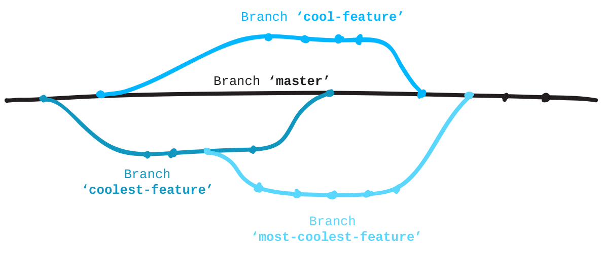

# What is Git?


I will let the "Queen of Git + R" explain

> "Git is a version control system. Its original purpose was to help groups of developers work collaboratively on big software projects. Git manages the evolution of a set of files – called a repository – in a sane, highly structured way. If you have no idea what I’m talking about, think of it as the “Track Changes” features from Microsoft Word on steroids." - [Jenny Bryan](http://happygitwithr.com/big-picture.html)


](images/vc-xkcd.jpg)

# Getting set up with GitHub

Before we begin learning git, it will be helpful to have a place to work on our projects. We will all use a GitHub account.

Please go to GitHub (https://github.com/signup) and create an account. I recommend you use a personal email address that way you can still have access in the future.

**Remeber your username and password**, this will be necessary for connecting to git.


# Installing Git

Since we're all on Mac's it will be easy to install. Simply try running a git command, and if you have git, it will work. Otherwise, it will prompt you to install it.

1. Open the terminal. 
  - Press `command + space bar`. This will pull up spotlight search.
  - Type in `"terminal"`, press enter when the application has appeared.
2. Once inside terminal, type `git --version`. This will either tell you which version of git you have installed, or prompt you to install `xcode`.
  - If prompted, begin downloading.
3. If / once you have completed downloading, run `git --version` to double check that it is installed.


# Git Configured

* There is one more step necessary before you can make changes and push them to GitHub. 
* You need to connect your account to your machine. Do this by running the line below.
* Ensure that you've used the same username and email as you did when you created your GH account.

```{r, eval = F}
git config --global user.name 'Your Name'
git config --global user.email 'personal@email.com'
git config --global --list
```


# You're still confused, I get it. Me too.


# Important lingo: Repo[sitory]

A repo is any place where you store stuff on a computer. Also called a directory or a folder, or whatever you may.


# Master Repo

GitHub hosts a **master** repo. This is the code that you want to keep safe and only change when you are certain that it won't break everything. This _repo_ lives **remotely** on GitHub.


# Making Changes

To make changes to the master, you must first have access to it. To do so you must **clone**  it to a **local** repository. 

You and your coworkers will each have your own personal version of the project. 

This means that you and your coworkers can work on the same project without changing eachothers code!

Adding changes to the master is called **pushing**. You push changes in small increments called **commits**. Once these are pushed to the master, they are then **merged** with the master, creating an official change to the master repo.


# The Commit

Commits are the bread & butter (and bane!) of Git.

**Verb**: "I just _committed_ a change to master!"

**Noun**: "I made a commit to fix that annoying bug `r emo::ji("upside-down")`"


# Guidelines to a good commit

Commits are to help you help you! You will forget what you did and why. So the commit is where you tell yourself what you did, to what, and for why.

Tips: 

* Use the present tense!
* Be explicit about what the commit does
* One commit per significant change


**BAD**
```
git commit -m "I fixed it"
```

**Good Commit**

```
git commit -m "Update read_data() function for goal import in goal_data.R"
```

# Let's just try it out!

## The workflow:

1. Create a repository on GitHub
2. Connect local directory to GitHub (clone)
3. Create / modify files
4. Stage files (add)
5. Commit the Changes (commit)
5. Push changes (push)


# Create a repository on GitHub


-----


# Create Files

Buckle up friends, this is where it gets weird. 

### Shell Commands:

* `pwd`: print working directory. 
  - Helps when you get lost in a world of text
* `cd`: change directory
* `mkdir`: make directory
* `vi`: Opens the most frustrating editor you will ever encounter. Let's make it easy.
  - Shortcuts:
    - `i`: allows you to start entering new text.
    - `esc`: stops you from entering text. Brings up a colon `:`.
      - `w`: write, saves the changes
      - `wq`: write and quit
      - `q!`: Oh dear god I messed something up, leave now and don't save _**anything**_
  

# Navigating & Making a New Directory

* I have a `github` directory stored under my user for ease of navigating
* Let's create a `github` directory, and a `CNG_training` directory (repo) 
  * This will connect to our `CNG_training` GitHub repository

```{r eval=F}
# Figure out where you are
pwd

# Make Github folder
mkdir github

# Navigate to the new folder
cd github

# Make a Camp Next Gen training folder
mkdir CNG_training

# navigate to the new folder
cd CNG_training
```

# Creating the README

* We are going to create a markdown—a type of text styling language—called `README.md`.
  - If you want a cheat sheet, go [here](https://github.com/adam-p/markdown-here/wiki/Markdown-Cheatsheet)!
* This file is what is shown at the home page of your GitHub repository.
* We will create this using the `VIM` editor. 
* Typing `vi filename` will open the editor. 
  - If there is no file with the `filename` it will create it.
  


# Connecting to GitHub

We're going to follow the guidelines from the _Quick Start_ page that is shown on any new GitHub repository, but we're going to skip the first line (`echo`). 

Before you `commit` run `git status` to see status of the `README.md` file.


# Your First Commit!


# Modify your README

* Enter VIM and make some changes to your `README.md`

```{r eval=F}
vi README.md
```


# Stage & Commit

* _Stage_ changes to `README.md`
* Commit the changes

```{r eval=F}
git add . # this adds all files modified or untracked
git commit -m "Your commit message, make it good!"
git push # Push to the master branch
```

# The changelog!

* Now that you have created two different commits, you can look at your **changelog**.
* This is a list of all commits you've made.

```{r eval = F}
git log
```


# Branching

* What happens when there are multiple people working on the same project and are making a bunch of changes all the time? Mayhem!
* Like a tree, Git builds branches. 
* Each branch is created as a copy of the master repository
  * people can make changes on the branch and not the master!




# Pull Requests

Once you have finished development on your branch and want to get it back into the master you need to create a pull request!

This is best done on GitHub.


# Branching Workflow

* Make sure all of your desired changes are committed & pushed
* Create a new branch
* Enter that new branch
* Make changes in that new branch
* Push changes
* Go on GitHub, merge branches

# Creating a new branch

* `git checkout`: switches branches
  - `-b branch_name`: creates and switches to that new branch

```{r eval=F}
git checkout -b development
```


# Make changes in the new branch

* In this new branch, open `README.md` and make some changes
* Make a new commit
* Push commit **be careful**!
  - Must specify the **`origin`** (the branch name)

```{r eval = F}
vi README.md
git add README.md
git commit -m "your commit message"
git push origin development
```


# Your New Branch


# The Pull Request


# Create the Pull Request


# Check Changed Files


# Merge It!


# Verify it merged!


# Pull It

* Navigate back to your terminal
* Switch back to the master branch
* Pull the changes

```{r eval=F}
# Switch branches
git checkout master

# Get new changes!
git pull
```


# Final exercise! 

Fork `josiahparry/CNG_training` repository
Clone that repository 
Add an acronym and its definition to `acronyms.csv`

